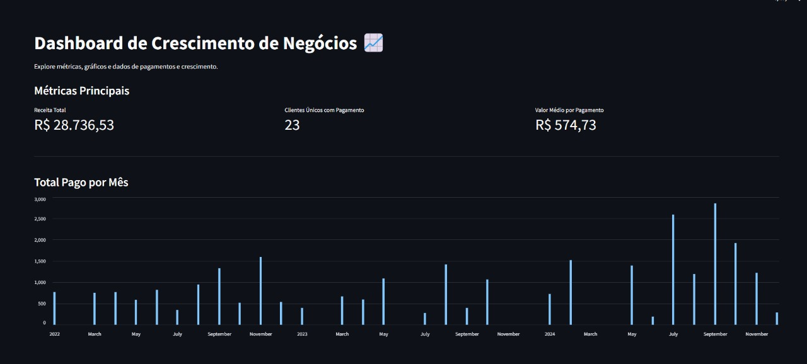

# 📈 Dashboard Interativo de Crescimento de Negócios (Streamlit)

Este projeto é um aplicativo web interativo construído com **Streamlit** que se conecta a um banco de dados **Firebird** para visualizar dados de pagamentos. Ele apresenta métricas financeiras chave, gráficos de tendências de crescimento e utiliza **Inteligência Artificial** (Google Generative AI) para gerar insights de negócios acionáveis com base nos dados.

---

## ✨ Funcionalidades

* **Interface Interativa:** Dashboard web responsivo e fácil de usar construído com Streamlit.
* **Visualização de Dados:** Exibe métricas principais (Receita Total, Clientes Únicos, Valor Médio por Pagamento).
* **Gráficos Analíticos:** Apresenta gráficos de barras (Total Pago por Mês, Top 10 Clientes por Total Pago) e gráficos de linha (Crescimento Acumulado por Cliente).
* **Análise por IA:** Integração com a API Google Generative AI para analisar os dados carregados e fornecer insights de negócios em formato de texto diretamente no dashboard (requer configuração de API Key).
* **Formatação Localizada:** Formata valores monetários e datas utilizando a localização brasileira (`pt_BR`).
* **Conexão Segura:** Acessa credenciais do banco de dados Firebird e a chave da API Google AI de forma segura usando o sistema de segredos nativo do Streamlit (`.streamlit/secrets.toml`).

---

## 🛠️ Tecnologias Utilizadas

* [**Python**](https://www.python.org/): Linguagem de programação principal.
* [**Streamlit**](https://streamlit.io/): Framework para construir e compartilhar aplicativos web de dados em Python.
* [**fdb**](https://pypi.org/project/fdb/): Driver Python para conexão com banco de dados Firebird.
* [**pandas**](https://pandas.pydata.org/): Biblioteca essencial para manipulação e análise de dados em DataFrames.
* [**matplotlib**](https://matplotlib.org/): Biblioteca de visualização (usada indiretamente pelo Streamlit para alguns gráficos).
* `locale`: Módulo padrão do Python para formatação localizada.
* [**google-generativeai**](https://pypi.org/project/google-generativeai/): SDK Python para interagir com a API Google Generative AI.

---

## 📦 Instalação e Configuração

Siga os passos abaixo para configurar e rodar o dashboard:

1.  **Clone o repositório (se aplicável):**
    Se o código estiver em um repositório Git, clone-o:
    ```bash
    git clone [https://github.com/seu-usuario/seu-repositorio.git](https://github.com/seu-usuario/seu-repositorio.git)
    cd seu-repositorio
    ```
    *(Substitua `seu-usuario/seu-repositorio.git` pelo caminho real, se houver)*

2.  **Crie um ambiente virtual (Recomendado):**
    ```bash
    python -m venv venv
    ```

3.  **Ative o ambiente virtual:**
    * **Linux/macOS:**
        ```bash
        source venv/bin/activate
        ```
    * **Windows:**
        ```bash
        venv\Scripts\activate
        ```

4.  **Instale as dependências:**
    Crie (ou atualize) um arquivo chamado `requirements.txt` na raiz do projeto com o seguinte conteúdo:
    ```
    streamlit
    fdb
    pandas
    matplotlib # Opcional, mas boa prática incluir se o código usar ou depender dele
    google-generativeai
    ```
    Então, instale as bibliotecas listadas:
    ```bash
    pip install -r requirements.txt
    ```

5.  **Configure os Segredos (`.streamlit/secrets.toml`):**
    Crie uma pasta chamada `.streamlit` na **raiz do seu projeto**. Dentro desta pasta `.streamlit`, crie um arquivo chamado `secrets.toml`. Este arquivo **NÃO deve ser compartilhado** nem versionado no Git, pois conterá suas credenciais sensíveis. Adicione o seguinte conteúdo, substituindo os valores pelos seus dados reais:

    ```toml
    # .streamlit/secrets.toml

    # Chave da API do Google Generative AI
    # Obtenha sua chave em [https://makersuite.google.com/keys](https://makersuite.google.com/keys)
    GOOGLE_API_KEY = "sua_chave_da_api_google_aqui" # <-- SUBSTITUA AQUI!

    # Credenciais para a conexão com o banco de dados Firebird
    [connections.firebird]
    dsn = 'C:\\caminho\\para\\seu\\banco.fdb' # <-- SUBSTITUA PELO CAMINHO REAL DO SEU BANCO!
    user = 'SYSDBA' # <-- SUBSTITUA PELO SEU USUÁRIO DO FIREBIRD!
    password = 'sua_senha_do_firebird' # <-- SUBSTITUA PELA SUA SENHA REAL DO FIREBIRD!
    ```
    *(Certifique-se de que o caminho para o DSN esteja correto para o seu sistema. Use barras duplas `\\` no Windows ou barras simples `/` dependendo de como o driver `fdb` interpreta.)*

---

## 🚀 Como Usar

Com o ambiente configurado e os segredos definidos, execute o script do dashboard (assumindo que o nome do arquivo é `dashboard.py`) a partir do terminal com o ambiente virtual ativado:

```bash
streamlit run dashboard.py




images/photo2.jpg